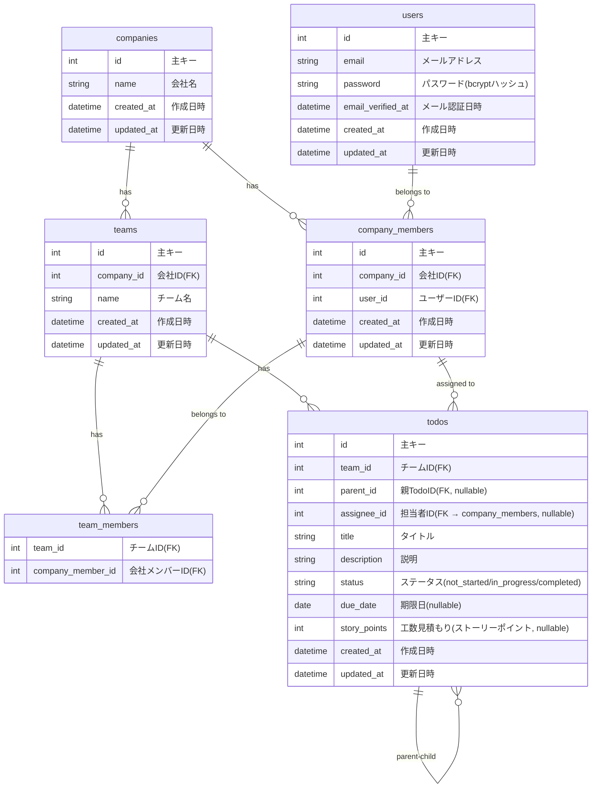

# ER図

```mermaid
erDiagram
    companies {
        int id "主キー"
        string name "会社名"
        datetime created_at "作成日時"
        datetime updated_at "更新日時"
    }

    users {
        int id "主キー"
        string email "メールアドレス"
        string password "パスワード(bcryptハッシュ)"
        datetime email_verified_at "メール認証日時"
        datetime created_at "作成日時"
        datetime updated_at "更新日時"
    }

    company_members {
        int id "主キー"
        int company_id "会社ID(FK)"
        int user_id "ユーザーID(FK)"
        datetime created_at "作成日時"
        datetime updated_at "更新日時"
    }

    teams {
        int id "主キー"
        int company_id "会社ID(FK)"
        string name "チーム名"
        datetime created_at "作成日時"
        datetime updated_at "更新日時"
    }

    team_members {
        int team_id "チームID(FK)"
        int company_member_id "会社メンバーID(FK)"
    }

    todos {
        int id "主キー"
        int team_id "チームID(FK)"
        int parent_id "親TodoID(FK, nullable)"
        int assignee_id "担当者ID(FK → company_members, nullable)"
        string title "タイトル"
        string description "説明"
        string status "ステータス(not_started/in_progress/completed)"
        date due_date "期限日(nullable)"
        int story_points "工数見積もり(ストーリーポイント, nullable)"
        datetime created_at "作成日時"
        datetime updated_at "更新日時"
    }

    companies ||--o{ company_members : "has"
    companies ||--o{ teams : "has"
    users ||--o{ company_members : "belongs to"
    teams ||--o{ team_members : "has"
    company_members ||--o{ team_members : "belongs to"
    teams ||--o{ todos : "has"
    todos ||--o{ todos : "parent-child"
    company_members ||--o{ todos : "assigned to"
```
